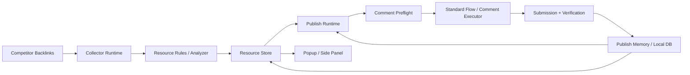

# 架构与技术链

## 1. 方法论

这套项目的核心不是“自动发评论”。

真正的主线是：

1. 从竞品外链出发
2. 识别可评论 / 可留链资源
3. 从评论区继续递归发现评论者网站
4. 再把这些网站送回外链采集链路
5. 用浏览器执行真实发布
6. 用模板与本地数据库沉淀经验

所以这不是单点插件，而是一套 **发现 -> 识别 -> 执行 -> 沉淀 -> 调度** 的闭环系统。

---

## 2. 五层结构

### 2.1 发现层

负责外链入口收集、来源证据、递归扩散。

主要模块：

- [background/core/collector-runtime.js](../background/core/collector-runtime.js)
- [background/core/continuous-discovery-engine.js](../background/core/continuous-discovery-engine.js)
- [background/core/frontier-scheduler.js](../background/core/frontier-scheduler.js)
- [content/ahrefs-collector.js](../content/ahrefs-collector.js)
- [content/semrush-collector.js](../content/semrush-collector.js)
- [content/similarweb-collector.js](../content/similarweb-collector.js)

关键点：

- 不是依赖官方 API，而是直接在浏览器层打开页面、执行、拿数据
- 采集结果会进入 frontier 和资源池
- 评论区发现的评论者域名也能继续进入递归分析

### 2.2 识别层

负责把“看起来像机会的页”变成“可调度的结构化资源”。

主要模块：

- [utils/resource-rules.js](../utils/resource-rules.js)
- [content/page-analyzer.js](../content/page-analyzer.js)

核心输出：

- `resourceClass`
  - `blog-comment`
  - `profile`
  - `inline-comment`
  - `weak`
- `linkModes`
  - `website-field`
  - `raw-html-anchor`
  - `rich-editor-anchor`
  - `markdown-link`
  - `bbcode-link`
  - `plain-url`
  - `profile-link`
- `frictionLevel`
  - `low / medium / high`
- `directPublishReady`

这里的目标不是只回答“有没有评论框”，而是回答：

- 这是不是文章评论页
- 能不能免登录/低摩擦直发
- 留链方式到底是什么

### 2.3 执行层

负责在真实页面里完成发布。

主要模块：

- [content/comment-preflight.js](../content/comment-preflight.js)
- [content/comment-standard-flow.js](../content/comment-standard-flow.js)
- [content/comment-executor.js](../content/comment-executor.js)
- [content/comment-publisher.js](../content/comment-publisher.js)
- [background/core/publish-runtime.js](../background/core/publish-runtime.js)

内部再分 3 层：

#### a. 预处理

- 提前滚动到评论区
- 处理 cookie/consent
- 预激活表单
- 重复评论预检

#### b. 标准页快链

面向标准 WordPress / 经典评论页：

- 直接识别 `#commentform / wp-comments-post`
- 优先直填 comment/name/email/website
- 不先走 AI 表单识别
- 尽快进入提交与校验

#### c. 通用页执行器

面向非标准表单或复杂编辑器：

- comment 专用执行器
- 候选编辑器打分
- 镜像 textarea 排除
- 回读校验
- 失败回退

执行档位：

- `fast`
- `hybrid`
- `ai`

### 2.4 沉淀层

负责把每次运行变成可复用经验。

主要模块：

- [background/core/publish-memory.js](../background/core/publish-memory.js)
- [utils/local-db.js](../utils/local-db.js)
- [background/core/resource-store.js](../background/core/resource-store.js)
- [background/core/state-store.js](../background/core/state-store.js)

当前主要沉淀：

- `siteTemplates`
- `publishAttempts`
- `domain publish policies`
- `resource publish history`
- `collect snapshot`

模板记忆关注的不是只记“成功”，而是记录：

- host
- form signature
- comment editor type
- link mode
- review policy
- website policy
- 阻断原因

### 2.5 调度层

负责把资源池、任务、优先级和结果反馈串起来。

主要模块：

- [background/core/publish-runtime.js](../background/core/publish-runtime.js)
- [background/core/task-manager.js](../background/core/task-manager.js)
- [background/core/task-runner.js](../background/core/task-runner.js)
- [background/core/task-store.js](../background/core/task-store.js)
- [utils/workflows.js](../utils/workflows.js)

当前调度策略包括：

- 全自动发布队列
- 批量任务逐一执行
- 来源分层排序
- 域名冷却
- 跳过重复/明确阻断资源
- 审核中挂起

---

## 3. 数据链路

这条链里最关键的设计是：

- 资源不是平面列表，而是带证据和能力标签的对象
- 发布不是一次性动作，而是带模板记忆和失败恢复的运行时

---

## 4. 当前技术链

### 浏览器侧

- Chrome Extension Manifest V3
- Service Worker Background
- Content Script 注入
- Side Panel UI

### 数据与存储

- IndexedDB：主存储
- Chrome Storage：兼容迁移
- Google Sheets：可选同步

### 智能与规则

- 规则优先
- AI 辅助表单识别
- AI 辅助评论生成
- 站点模板记忆
- 失败恢复策略

### 调度与状态

- 任务工作流
- 发布会话状态机
- 批量执行
- 自动接力调度

---

## 5. 当前工程判断

这套代码已经从“单文件补丁插件”走到了“有明显模块边界的系统”，但还没到最终形态。

当前最明显的工程现实是：

- `background/background.js` 仍然偏大
- `popup/popup.js` 仍然承担太多 UI 状态逻辑
- 评论发布链虽然已经拆出 `preflight / standard-flow / executor`，但还需要继续去 God file 化

也就是说，方向是对的，但还在持续重构期。

---

## 6. 后续重点

如果继续往下做，最有价值的方向仍然是：

1. 继续强化标准评论页快链
2. 扩展 profile / directory / community 等非评论型发布工作流
3. 进一步做来源分层与调度策略
4. 把模板记忆从 host 级推进到 CMS / policy / anti-spam 级
5. 继续拆大文件，避免重新回到屎山
